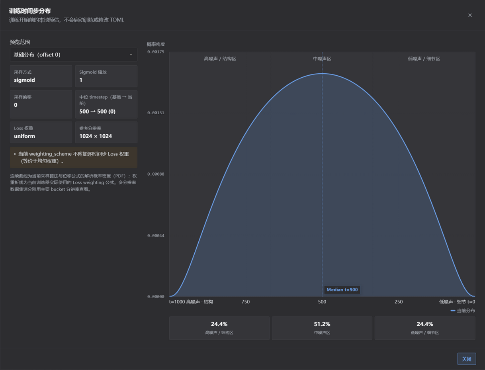
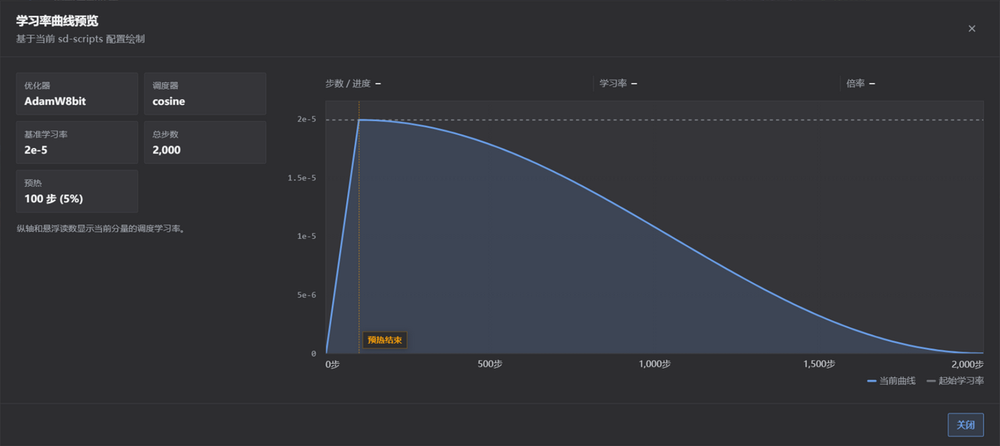
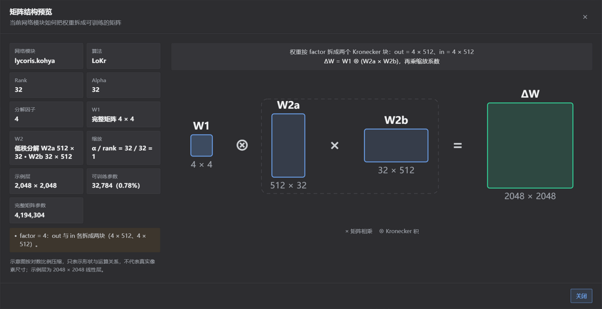

<div align="center">

# lora-scripts-anima

_✨ 多训练核心 LoRA 工具：Anima、SDXL 与 Krea 2 ✨_

面向本地运行的 LoRA 训练 GUI。Anima / SDXL 使用 [kohya-ss/sd-scripts](https://github.com/kohya-ss/sd-scripts)（位于 `vendor/sd-scripts/`），**Krea 2 LoRA** 使用 [kohya-ss/musubi-tuner](https://github.com/kohya-ss/musubi-tuner)。

</div>

<p align="center">
  <a href="https://github.com/amenorira/lora-scripts-anima" style="margin: 2px;">
    
  </a>
  <a href="https://raw.githubusercontent.com/amenorira/lora-scripts-anima/main/LICENSE" style="margin: 2px;">
    
  </a>
</p>

<p align="center">
  <a href="https://github.com/amenorira/lora-scripts-anima/blob/main/README-en.md">English</a>
</p>

lora-scripts-anima 是一款本地 LoRA 训练图形界面。项目通过训练核心注册表隔离不同后端：**sd-scripts** 负责 SDXL / Anima，**LyCORIS** 是通过 `lycoris.kohya` 挂载的可选适配器后端，**musubi-tuner** 负责 Krea 2 RAW DiT LoRA。

### 支持的模型类型

| 训练类型 | 底模 |
|---------|------|
| LoRA | SDXL |
| **LoRA** | **Anima**（Qwen3 + T5 双编码器） |
| **LoRA** | **Krea 2 RAW DiT**（musubi-tuner） |

> ℹ️ Krea 2 在训练前必须生成 latent 与 Qwen3-VL 文本编码输出两类缓存。界面会在“开始训练”前验证缓存是否完整、且是否仍与图片、标签和模型匹配。

> ℹ️ `vendor/sd-scripts/` 训练引擎本身支持 SD3 / FLUX / HunyuanImage / Lumina 等更多模型，但当前 UI 尚未提供这些模型的训练入口。

## 功能简介

- **训练 WebUI** — 一站式工作台，包含 LoRA 训练表单、TOML 配置预览、配置导入导出和训练历史记录
- **训练前预览** — 时间步分布、学习率曲线与矩阵结构三个本地预览弹窗，[见下一节](#pre-training-previews)
- **LyCORIS 适配器面板** — 支持 LoCon / LoHa / LoKr，按算法动态显示参数，可选内核后端（auto / Triton / TileLang / compile / Torch），并支持 LoRA+ 与 Anima 训练范围细化
- **多种优化器** — AdamW、Lion、Prodigy、CAME、StableAdamW、Adafactor、ScheduleFree、Adan、AdEMAMix、Muon 等常用优化器，外加内置的 LoRA-RITE 与测试中的 LoRA-Muon，各自带默认值与约束提示
- **实时硬件监控** — 显示 GPU 利用率、显存与温度，以及 CPU/RAM 使用率；集成 Chart.js 动态图表、TensorBoard 和实时日志
- **原生标签编辑器** — 内置图片标签编辑器，支持批量查找替换、去重、排序、清理等操作
- **Tagger 工作台** — 集成 WD EVA02-Large、WD ViT-Large、CL Tagger 与 Camie Tagger，支持单图检查、分类阈值控制和批量标签写入；另可对接 OpenAI 兼容（Chat Completions / Responses）或 Anthropic Messages 协议的 AI 打标
- **Flash Attention 智能安装** — 面向 Python 3.12 + PyTorch 2.10+cu130 固定基线提供预编译 wheel，多镜像回退下载（断点续传 + 本地缓存），支持一键安装
- **EmoSens 自适应优化器** — 内置 EmoSens v3.9，对 Anima DiT 训练有更好的收敛效果
- **国际化（i18n）** — 中英双语界面，支持浏览器语言自动检测并保存语言偏好
- **三种主题** — 浅色、深色与 ComfyUI 主题，支持跟随系统、手动切换
- **后端连接状态指示器** — 实时显示前后端连接状态及断连时长
- **慢速远程连接兼容** — 使用同源实时传输、弱网缩略图队列和版本化浏览器缓存，降低预览请求对实时状态传输的影响

<a name="pre-training-previews"></a>

## 训练前预览

训练表单里的三个预览弹窗都用当前参数在本地计算，不会启动训练，也不会修改 TOML。

### 时间步分布预览

在 **训练时间步采样方式** 字段下方点「查看时间步分布」。弹窗绘制当前采样方式与位移公式的解析概率密度曲线，叠加训练器实际使用的 Loss 权重折线，并标出中位时间步与高 / 中 / 低噪声区间的占比。改完参数后点「按当前参数刷新」即可重新计算。



### 学习率曲线预览

在 **学习率变化方式** 字段下方点「查看学习率曲线」。弹窗按 sd-scripts 的调度公式绘制预热、衰减与重启曲线，鼠标悬浮可读取任意步数的学习率。ScheduleFree、EmoSens 这类在训练中自行调整学习率的优化器会显示说明，不再绘制可能误导的曲线。



### 矩阵结构预览

Anima 训练下，**训练网络模块** 字段下方点「结构预览」。弹窗按当前网络模块和算法画出权重如何拆成可训练矩阵——低秩分解（LoRA / LoCon）、LoHa 的 Hadamard 积、LoKr 的 Kronecker 分解，以及 DoRA、rs_lora、Full Matrix 等参数对形状与缩放的影响，同时给出示例层的可训练参数量与占比。



## 项目结构

```
lora-scripts-anima/
├── vendor/sd-scripts/          ← Anima / SDXL 训练引擎（固定上游快照）
├── vendor/musubi-tuner/        ← Krea 2 训练核心（固定上游快照）
├── vendor/lycoris/             ← LyCORIS 适配器后端（固定上游快照）
├── vendor/emo_optimizer/       ← EmoSens 自适应优化器
├── vendor/lora_rite/           ← LoRA-RITE 优化器
├── vendor/lora_muon/           ← LoRA-Muon 测试优化器
├── backend/                    ← FastAPI 后端
│   ├── server/                 ← API 核心（路由、状态、代理）
│   ├── training/               ← 训练引擎封装（参数适配、字段注册表、进程管理）
│   ├── monitor/                ← 训练监控（GPU/系统/日志/预览/历史）
│   ├── tageditor/              ← 原生标签编辑器
│   ├── tagger/                 ← 打标模块（WD / CL / Camie / AI 接口）
│   └── gui.py                  ← GUI 内部入口（由启动脚本调用）
├── frontend/                   ← Alpine.js SPA 前端
├── config/                     ← 本地配置与自动保存
├── docs/                       ← 参数指南与预览截图
├── tools/                      ← 独立工具（Flash Attn 安装等）
├── start.bat / start.sh        ← 启动脚本
├── requirements.txt            ← 项目额外依赖（sd-scripts 核心依赖由 vendor 单独安装）
└── requirements-musubi-krea2.txt ← 主环境的 Krea 2 版本收敛依赖
```

## 使用方法

### 必要依赖

- **Python**：需要 64 位 Python 3.12（项目基线版本，预编译依赖与安装流程均以此为准）
- **Git**：用于下载和更新项目；Windows ZIP 下载版可在首次启动时自动安装
- **PyTorch 2.10.0 + CUDA 13.0**：由启动脚本自动安装，兼容 RTX 30/40/50 全系列
- **NVIDIA 驱动 R580 或更高版本**：CUDA 13.0 的最低驱动要求

> **Windows 用户无需提前安装 Python/Git。** 首次运行 `start.bat` 时，启动器会寻找 64 位 Python 3.12，并跳过 Microsoft Store 的 Python 占位符。
>
> 如果电脑只有 Python 3.13/3.14，可按提示为当前用户并行安装官方 Python 3.12。启动器不会卸载现有 Python，也不会修改系统默认 Python。下载时会显示进度、文件大小、速度和 ETA；静默安装阶段会显示加载动画。
>
> **Linux 用户**需要自行安装 64 位 Python 3.12。多数 Python 安装已包含创建 `venv` 的功能；只有 Ubuntu/Debian 等系统提示缺少该功能时，才需要额外安装对应的软件包（例如 `python3.12-venv`）。
>
> 如果项目中已经存在由其他 Python 版本创建的不兼容 `venv`，请只删除或重命名项目内的 `venv` 文件夹，再重新运行当前平台的启动脚本。

| GPU 系列 | 自动安装的 PyTorch | CUDA |
|----------|:------------------:|:----:|
| RTX 30 系 (Ampere) | 2.10.0 | 13.0 |
| RTX 40 系 (Ada) | 2.10.0 | 13.0 |
| RTX 50 系 (Blackwell) | 2.10.0 | 13.0 |

已有 cu128 `venv` 会在下次启动时自动升级。已经安装的 xformers、FlashAttention、Triton 和 bitsandbytes 会同步匹配 cu130，ONNX Runtime GPU 会切换到 CUDA 13 对应版本；未安装的可选库保持不变。

无 NVIDIA 显卡的机器仍会安装完整的 GPU 依赖环境并可正常运行 GUI，但训练功能需要 NVIDIA 显卡。

> **Krea 2 共享环境**：Krea 2 与 sd-scripts 共用项目主 `venv` 和同一套 CUDA 版 PyTorch。启动器先安装上游 sd-scripts 依赖，再通过本项目的 `requirements-musubi-krea2.txt` 将共享依赖统一到 `transformers 4.57.6` / `tokenizers 0.22.2`。
>
> 日常启动只进行快速元数据检查。版本匹配时，不会重复运行 pip、卸载或重装软件包，也不会导入完整的 Krea 2 运行栈。依赖同步完成后，以及执行 Krea 2 预检时，启动器会运行完整的导入验证。此过程不会修改 `vendor/` 中的上游依赖文件。

> 旧版本遗留的 `venv/cores/musubi` 不再被读取、写入或自动删除。确认项目主 `venv` 可以正常训练后，可手动删除该目录以回收磁盘空间。

> 国内用户设置清华镜像：`set PIP_INDEX_URL=https://pypi.tuna.tsinghua.edu.cn/simple` 后运行 `start.bat`。

### Windows：直接下载 ZIP（小白推荐）

1. 在 GitHub 点击 **Code → Download ZIP**，完整解压后双击 `start.bat`。
2. 如果目录中没有 `.git`，启动器会询问是否安装 Git for Windows 并修复为可更新仓库；选择推荐项即可。
3. 修复时会拉取最新 `main`。若 ZIP 源码与最新版不同，待替换的源码会先备份到 `bootstrap-backups/<时间>.zip`。`venv`、模型、输出、缓存、日志和整个 `config` 用户配置目录不会参与源码同步，也不会被覆盖或清理。
4. 源码同步完成后，启动器会自动重启一次，再创建 `venv` 并安装训练依赖。

Git 安装或仓库修复失败不会阻止训练器启动，下次运行仍可重试。Python 或核心依赖安装失败时则会停止并显示双语错误。

### 使用 Git 克隆

```sh
git clone https://github.com/amenorira/lora-scripts-anima.git
cd lora-scripts-anima
```

### 快速开始

| 平台 | 安装 + 启动 |
|------|------------|
| Windows | `.\start.bat` |
| Linux | `bash start.sh` |

首次启动会自动创建虚拟环境并安装所有依赖。启动后 GUI 自动打开 [http://127.0.0.1:12333](http://127.0.0.1:12333)。

> **RTX 40/50 系显卡用户**：启动脚本会自动检测 flash_attn 状态。如未安装，可在 GUI 的 **环境** 标签页中一键安装。

### 实时连接与慢速远程连接

网页的 HTTP 请求和实时连接始终与当前页面同源（same-origin）。训练器不会自动配置 SSH、端口映射、代理、云平台专用逻辑或额外的实时端口。如果你已经通过自己的方案访问远程页面，浏览器会继续沿用该入口。

- `/ws/realtime` 仅传递小型 JSON 状态、进度、日志增量和硬件数据；命令、图片、文件和元数据仍使用 HTTP。
- 侧栏只有在收到 WebSocket `ready` 消息和实时快照后，才会显示“后端已连接”。连续 2 秒没有有效实时数据时，只显示“实时数据延迟”；连接关闭且健康探测也失败后，才显示“后端离线”。
- 后端重启会更换实例 ID。网页会清除旧实例的任务、进度、日志、曲线与硬件快照，并明确提示先前的内存任务状态未知；当前版本不会扫描或接管遗留训练进程。
- **UI 设置 → 慢速远程连接兼容**默认开启：完整显示当前运行或历史记录的样本列表，缩略图以单请求、低优先级队列加载，并会在实时数据延迟时暂停。版本化缩略图可被浏览器缓存 24 小时；查看原图仍需用户主动点击。

### 后续更新

完成 ZIP 仓库修复或使用 `git clone` 后，在项目文件夹空白处右键：

- 选择 Windows 的 **在终端中打开**，然后运行 `git pull`；或
- 选择 **Git Bash Here** 后运行 `git pull`。Windows 11 中该菜单可能位于 **显示更多选项** 内。

仓库仅允许快进更新。如果源码被手动修改，`git pull` 会停止并提示先处理本地改动，不会自动覆盖。

## 训练参数指南

详细的训练参数说明见 `docs/parameters/`：

- [LoRA+ 指南](docs/parameters/lora-plus.zh-CN.md)：LoRA+ 的原理、倍率选择、优化器兼容性与判断方法
- [优化器选择与参数指南](docs/parameters/optimizers.zh-CN.md)：优化器对比、学习率/weight decay 等参数起点、按数据集选择
- [时间步指南](docs/parameters/timesteps.zh-CN.md)：flow matching 时间步采样、Loss 权重与分布预览说明
- [AdaLN 调制层指南](docs/parameters/adaln.zh-CN.md)：调制层的作用、上游默认行为，以及哪些训练适合开启

## 程序参数

| 参数名称 | 类型 | 默认值 | 描述 |
|---------|------|--------|------|
| `--host` | str | "127.0.0.1" | 服务器主机名 |
| `--port` | int | 12333 | 服务器端口 |
| `--listen` | bool | false | 启用监听模式（允许外部访问） |
| `--skip-prepare-environment` | bool | false | 启动时不再自动检查和修复依赖环境 |
| `--skip-prepare-onnxruntime` | bool | false | 只跳过 onnxruntime-gpu 的安装检查 |
| `--disable-tensorboard` | bool | false | 不随 GUI 启动内置的 TensorBoard |
| `--tensorboard-host` | str | "127.0.0.1" | TensorBoard 主机 |
| `--tensorboard-port` | int | 6006 | TensorBoard 端口 |
| `--localization` | str | | 界面语言与本地化设置 |
| `--dev` | bool | false | 开发者模式 |
| `--quiet` / `-q` | bool | false | 自动安装 Python/venv 依赖；默认不执行可选的 Git 仓库修复 |
| `--setup-git` | bool | false | Windows：非交互执行推荐的 Git 安装/ZIP 仓库修复 |
| `--skip-git-setup` | bool | false | Windows：本次启动不提示 Git 安装或仓库修复 |

## Flash Attention 加速

RTX 40/50 系显卡推荐安装 flash_attn 以获得最佳训练性能。

### GUI 安装

启动 GUI 后，在 **环境** 标签页中点击安装即可。脚本面向 Python 3.12 + PyTorch 2.10+cu130 固定基线，通过多镜像回退下载预编译 wheel（断点续传 + 本地缓存），支持离线直装本地 .whl。

### 手动安装

Windows：

```powershell
.\venv\Scripts\python.exe tools/install_flash_attn.py           # 交互式安装
.\venv\Scripts\python.exe tools/install_flash_attn.py --url URL # 指定 wheel URL 或本地 .whl 路径
.\venv\Scripts\python.exe tools/install_flash_attn.py --yes     # 非交互自动安装
.\venv\Scripts\python.exe tools/install_flash_attn.py --force   # 已安装也强制重装
```

Linux：

```sh
./venv/bin/python tools/install_flash_attn.py           # 交互式安装
./venv/bin/python tools/install_flash_attn.py --url URL # 指定 wheel URL 或本地 .whl 路径
./venv/bin/python tools/install_flash_attn.py --yes     # 非交互自动安装
./venv/bin/python tools/install_flash_attn.py --force   # 已安装也强制重装
```

## EmoSens 自适应优化器

项目内置了 EmoSens v3.9 自适应优化器（`vendor/emo_optimizer/`），对 Anima DiT 模型训练有更好的收敛效果。

### 推荐设置

| 训练类型 | 学习率 | 调度器 | max_grad_norm |
|---------|:------:|:------:|:-------------:|
| SDXL LoRA | 1.0 | constant | 0 |
| Anima LoRA (DiT) | 0.1 | constant | 0 |

在训练表单的优化器下拉菜单中选择 `EmoSens` 即可使用。

## TOML 配置导入导出

支持将当前训练参数导出为 TOML 文件，并从 TOML 文件导入到训练表单。

- **导出**：在训练页右侧参数预览中下载当前 TOML 配置
- **导入**：选择 TOML 文件，将有效字段填入对应训练类型的表单

## 环境管理

GUI 的 **环境** 标签页提供：
- Python / PyTorch / CUDA 版本信息
- sd-scripts、LyCORIS 适配器后端与 musubi-tuner 的核心状态
- musubi-tuner Krea 2 共享运行时状态（与 sd-scripts 共用 CUDA 版 PyTorch，并显示依赖版本是否已统一）
- Flash Attention 安装状态检测与一键安装
- 候选 wheel 列表预览

## 开发测试

运行后端测试套件（需先安装测试依赖，仅开发需要，不影响训练运行时）：

```
.\venv\Scripts\python.exe -m pip install -r requirements-dev.txt
.\venv\Scripts\python.exe -m pytest tests
# Linux: ./venv/bin/python -m pip install -r requirements-dev.txt
#        ./venv/bin/python -m pytest tests
```

## 致谢

- [kohya-ss/sd-scripts](https://github.com/kohya-ss/sd-scripts) — Anima / SDXL 训练引擎
- [kohya-ss/musubi-tuner](https://github.com/kohya-ss/musubi-tuner) — Krea 2 训练核心
- [Akegarasu/lora-scripts](https://github.com/Akegarasu/lora-scripts) — 早期设计参考
- [mjun0812/flash-attention-prebuild-wheels](https://github.com/mjun0812/flash-attention-prebuild-wheels) — flash_attn prebuilt wheel 源

## 许可证

本项目以 [MIT 许可证](LICENSE) 发布。`vendor/` 目录下的第三方组件各自保留其原始许可证（Apache-2.0 / MIT）。
